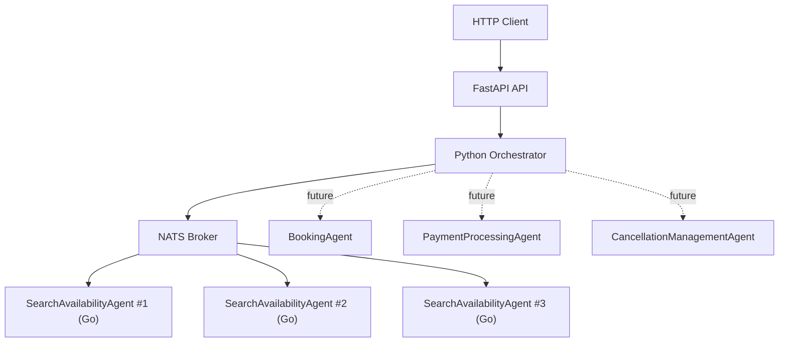
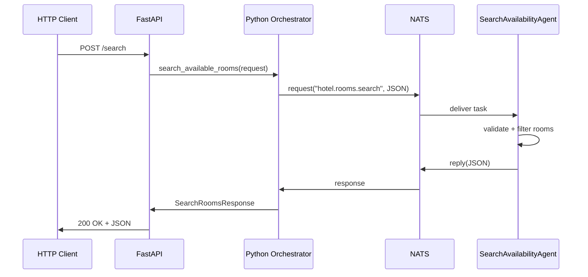

# Архитектура системы бронирования гостиниц

## 1. Типы агентов и их роли

### SearchAvailabilityAgent

- Роль: ищет свободные номера по параметрам запроса.
- Входные данные: `request_id`, `city`, `check_in`, `check_out`, `guests`, `rooms`, `max_price`.
- Выходные данные: `status`, `agent_id`, `message`, список `available_rooms`, `handled_tasks`.
- Бизнес-правила:
  - дата заезда должна быть раньше даты выезда;
  - длительность проживания не более 30 ночей;
  - вместимость номера должна покрывать число гостей;
  - номер не должен быть занят в выбранные даты;
  - если указан `max_price`, цена номера не должна его превышать.

### BookingAgent

- Роль: создаёт бронь на выбранный номер.
- Входные данные: `booking_request_id`, `room_id`, `guest_profile`, `check_in`, `check_out`, `payment_hold_id`.
- Выходные данные: `booking_id`, `status`, `total_amount`, `expires_at`.
- Бизнес-правила:
  - номер должен быть предварительно найден как доступный;
  - данные гостя обязательны;
  - бронь подтверждается только после успешного холда или оплаты;
  - один и тот же номер нельзя забронировать дважды на одинаковый интервал.

### PaymentProcessingAgent

- Роль: обрабатывает оплату или предавторизацию.
- Входные данные: `payment_request_id`, `booking_id`, `amount`, `currency`, `payment_method`.
- Выходные данные: `payment_id`, `status`, `processed_at`, `failure_reason`.
- Бизнес-правила:
  - сумма должна быть больше нуля;
  - валюта должна соответствовать тарифу;
  - неуспешная оплата переводит бронирование в состояние `payment_failed`;
  - повторная оплата не должна списывать деньги повторно без явного повтора запроса.

### CancellationManagementAgent

- Роль: обрабатывает отмены и рассчитывает возврат.
- Входные данные: `cancellation_request_id`, `booking_id`, `cancelled_at`, `reason`.
- Выходные данные: `status`, `refund_amount`, `penalty_amount`, `released_inventory`.
- Бизнес-правила:
  - бесплатная отмена возможна только до дедлайна тарифа;
  - если срок бесплатной отмены истёк, применяется штраф;
  - завершённые или уже отменённые брони повторно не отменяются;
  - после успешной отмены номер возвращается в доступный инвентарь.

## 2. Исполняемые компоненты

- `SearchAvailabilityAgent` на Go:
  - подписывается на NATS queue-subscription `hotel.rooms.search`;
  - принимает JSON;
  - валидирует запрос;
  - подбирает свободные номера из встроенного каталога;
  - публикует ответ в `reply` subject.

- `HotelOrchestrator` на Python:
  - подключается к NATS через `nats-py`;
  - отправляет задачу в subject нужного агента;
  - ждёт ответ с таймаутом;
  - делает retry до 3 раз;
  - считает обработанные задачи, ретраи и ошибки.

- `FastAPI API`:
  - принимает HTTP-запрос;
  - валидирует вход через Pydantic;
  - вызывает оркестратор;
  - возвращает ответ клиенту в формате JSON.

- `NATS`:
  - транспорт между оркестратором и агентами;
  - обеспечивает request/reply и queue-based load balancing.

## 3. Каналы обмена сообщениями

- `hotel.rooms.search` — поиск свободных номеров.
- `hotel.bookings.create` — создание брони.
- `hotel.payments.process` — проведение оплаты.
- `hotel.bookings.cancel` — отмена брони.

В текущем исполняемом прототипе реализован subject `hotel.rooms.search`. Остальные заложены как архитектурное расширение.

## 4. Диаграмма компонентов

## 5. Диаграмма взаимодействия

## 6. Компоненты мониторинга

- Логирование в консоль и файл.
- Уровни логов: `INFO`, `ERROR`.
- Метрики:
  - у Go-агента: `handled_tasks`;
  - у Python-оркестратора: `processed_tasks`, `retry_count`, `failed_tasks`;
  - у API: endpoint `/metrics`.

## 7. Балансировка нагрузки

Для `SearchAvailabilityAgent` используется queue-subscription `hotel-search-workers`. Если поднять 2–3 экземпляра агента, NATS будет распределять задачи между ними автоматически. Определить, какой экземпляр обработал запрос, можно по полю `agent_id` в ответе.
